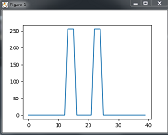

# Objective 
The objective of this module is 
 
  * Get the environments setup for kids. This is primarily for the parents. 
  * Start getting used to doing this (learning) remotely. 
  * Explain, at a very high level, what are computers, operating 
  systems, programming languages, editors etc. 
  * Get the kids to write a simple (_hello world_) program and run it

## For kids
This is the starting module. We will focus on installations, 
creating the environment, writing a hello world program in an editor 
, running it from the editor and from the command prompt. You 
will need an adult to help you with this section. 

## For Parents
In general, you need a python installation and an editor to get kids started. 
There are two kinds of setup: 

  * __Basic__: You should use the basic setup for first few classes. Then, depending on your kid's comfort level and interest, you can move on to the 
  more advanced setup. Advanced setup was documented first and some of you 
  have already followed the steps for the advanced setup. If so, do not worry, 
  your efforts are not wasted. Follow the basic instructions for now.

  * __Advanced__: This will be needed later but was documented first. 

In addition to the two kinds, you should also follow the instructions in the 
common setup section. 

# Common setup 
## Installing github 

You will find it useful to download programs and homework assignments using 
git instead of relying on  email or google drive.  Kids do not need to commit code, they just need to download the latest version using git clone. 
Pycharm also comes with a built in git client bnt  will post instructions for the 
command line git. Download and install the "windows setup" and not the "portable" distribution. from https://git-scm.com/download/win . 

## Identifying working directory
You should work with your child and identify a directory for all the work. 
We will checkout code into this directory as well as use this for saving your
child's work. If possible, the full path to this directory from the root of the file system should not contain any spaces. 

# Basic setup 
This setup is intended to minimize struggles with the environment and toolchain. 
We will use ["Code with Mu"](https://codewith.mu/) editor for this. Download the 
installer for your operating system and install it. 

After installing this editor, create a new file, cut and paste the following code  and run it to test your setup: 

```python
import numpy as np
from PIL import Image, ImageDraw, ImageFont
import matplotlib.pyplot as plt

def make_image(char, file_name):
    img = Image. new('L', (40, 40))
    font = ImageFont.truetype("arial.ttf", 20)
    drawer = ImageDraw.Draw(img)
    drawer.text((12,8), char, fill=(255), font=font)
    img.save(file_name)

def read_image(file_name):
    im_frame = Image.open(file_name)
    img_data = np.array(im_frame)
    print("Loaded data from file:{}. dimensions of imaged data:{}".format(file_name, img_data.shape))
    return img_data
    
def png_to_ascii(img_data):
    x,y = img_data.shape
    for i in range(x):
        for j in range(y):
            d = img_data[i,j]
            if d>0:
                d = 1
                img_data[i,j] = 255
            print(d, end="")
        print()    
    return img_data 

file_name="h.png"
make_image("H", file_name)
data = read_image(file_name)
png_to_ascii(data)
plt.plot(data[20,:])
plt.show()

```
If the setup works, you should see the following outputs 
| Console output  | New window with plot |
| ------------- | ------------- |
|  <!-- .element height="50%" width="50%" -->  | <!-- .element height="50%" width="50%" -->|


Possible idea for kids: 

 * Show them the console output and ask them if they can make out the letter being shown. 
 * Ask them if they can figure out how to change "1"s to "x" in the console output. png image created by this program is saved in the same folder where you saved the python code. 
 * Explain the loop and the 2-D structure of the data and ask them if they 
 can explain the plot. This may not be easy. 

# Advanced setup 
This setup will be needed a little later when the kids get more familiar with 
the basic idea of  editor based code writing. It is perfectly alright if you

## Downloading and installing python 

We will use anaconda, a really fat python distribution that comes with a lot 
of bells and whistles. You can download Anaconda from https://www.anaconda.com/products/individual. Make sure you get the latest version with graphic 
installer. At the time of this writing, latest version is for python 3.7. 

Install anaconda at the file system root on windows. Makes sure there are 
no white spaces or special characters in the installation path. I have 
not installed Anaconda on Macs but you should have an option to install it 
within your child's home directory. 

The following discussion assumes that you  have installed anaconda at 
``c:/Anaconda3``. 

## First time configuration
Start command prompt, change directory to ``c:/Anaconda3/Scripts`` and 
run the command 

    conda 

If you are running this command for the first time, you will see a few 
instructions. Follow the instructions to add conda options to your path. 
Since I do not have a new computer to try this on, I cannot at this time 
provide exact instructions. 

## Create an isolated environment 
Kids will mess up their environment. Even adults do this hence the need for 
virtual environments. It will also help me manage dependencies to make sure 
we have a consistent python environment for all kids. Assuming that you configured  ``conda`` correctly in the previous step,  execute the following 
command in a windows command prompt (or mac/linux terminal). 

    
    conda create -n py4kids.l1  python=3.8.2  matplotlib   numpy pandas scikit-learn

If this goes well, last few lines of the output should look something like 

        #
        # To activate this environment, use
        #
        #     $ conda activate py4kids.l1
        #
        # To deactivate an active environment, use
        #
        #     $ conda deactivate

To check this environment, activate  and then type ``python`` on the command prompt. 

    conda activate py4kids.l1 


Your output should look like  

    C:\Users\vatsyaya>conda activate py4kids.l1

    (py4kids.l1) C:\Users\vatsyaya>python
    Python 3.8.2 (default, May  6 2020, 09:02:42) [MSC v.1916 64 bit (AMD64)] :: Anaconda, Inc. on win32
    Type "help", "copyright", "credits" or "license" for more information.
    >>>

In the future, make sure you  are in the py4kids.l1 environment before you 
run steps for installing any of the packages. 

## Installling pycharm 

Pycharm has a free community version that you can download from https://www.jetbrains.com/pycharm/download/ . Download and install the editor. We will configure it to use the conda virtual environment interperter a little later. 
