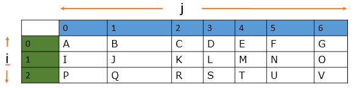
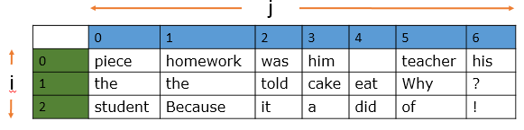

# Plan 

* More on variables, types and operations 
* Introduce lists and indexing 
* Changing lists - append and pop 
* For loop with lists 
* Introduce range 

# Variables continued 

Will the following code work? 

```python
a=49 
b=input("Enter number:")
c=b+a
```

What is wrong with it? How can you fix it? 

```python
a=49 
b=input("Enter number:")
b = int(b) 
c=b+a
print(c)
```

What does int(b) mean? 

Guess the output of the following code:
```python
a=5
b=9
c=b*a
print(c) 
c = a/b 
print(c) 
c = b/a
print(c) 
c = b//a 
print(c) 
c = b%a 
print(c)  
```

# Booleans and if condition 

* Comparison operator and booleans  
* Modulo operator along with boolean 

# Keeping track of more than one thing at a time 

```python
kids=["Prateek", "Svadrut", "Meghna", "Sanjana", "Ishaan", "Sid", "Ari" , "Shloak"] 

print(kids[0] )
print(kids[4])
print(kids[9] )
```
Listing all kids 
```python
kids=["Prateek", "Svadrut", "Meghna", "Sanjana", "Ishaan", "Sid", "Ari" , "Shloak"] 

print(kids[0] )
print(kids[4])

for kid in kids: 
    print("The kid is:{}".format(kid))
```
What does ``for`` do ? What about the indents? What is the "`:`"?

## Two dimensional data 

<!-- .element height="50%" width="50%" -->


## Complex Two dimensional data, homework 
<!-- .element height="50%" width="50%" -->

You can download the Joke code by [clicking here](https://raw.githubusercontent.com/abhijat01/py4kids.l1.2019/master/module-01/code-02/joke_matrix.py) . For viewing the code online, go to the [github page](./code-02/joke_matrix.py) 

# Homework 
## Checking for divisibility 
Finish the following code to return true input `a` is divisible by input `b` . 

```python 
def is_divisible(a, b):
    answer = False 
    return answer 
```
[Download the code](https://raw.githubusercontent.com/abhijat01/py4kids.l1.2019/master/module-01/code-02/div.py), 
make changes to the `is_divisible()` section and see if you can get it to work

## Make the computer finish the joke 
The following table is hiding a joke.  
<!-- .element height="50%" width="50%" -->

Contents of each cell in the table are referred to using two integers, one for row and another for column. We discussed this 
briefly in the class. Your job is to identify the right sequence of cells so that the computer can print the joke. For this, 
you should [download the code](https://raw.githubusercontent.com/abhijat01/py4kids.l1.2019/master/module-01/code-02/joke_matrix.py)
and make changes to following line and then run the code. 

```python
answer_sequence = [(1,5), (2,4),(1,0),(2,0)]
```
The answer_sequence is a variable that refers to a list. 
This list contains "tuples", a way of  storing data that you have not yet seen. 
These "tuples" are entries like `(1,5)`. `(1,5)` refers to the 2nd row and the 6th column in the table. _Remember  that indices in the table start from 0, not 1_. Add more locations like 
`(1,5)` to this table and then run the code to see what is printed. If you manage to find the right sequence of locations, the program will print the joke hidden in the table. 

For viewing the code online, go to the [github page](./code-02/joke_matrix.py) 

## YouTube video on variables
Now that you have had an introduction to variables, you should watch the following YouTube  video 
on variables - [Learning to Code with Python: Lesson 1.3 - Variables](https://www.youtube.com/watch?v=TZ2yMHr1xSY). I might ask you to explain some ideas to the rest of the class 
in our next zoom meeting. 

## Make another joke puzzle
This is optional - can you make changes to the puzzle to hide another joke in it and then 
make the computer print it? If you can, share the code with me  and I will share only the puzzle with the rest of the class and ask others to solve it.  


